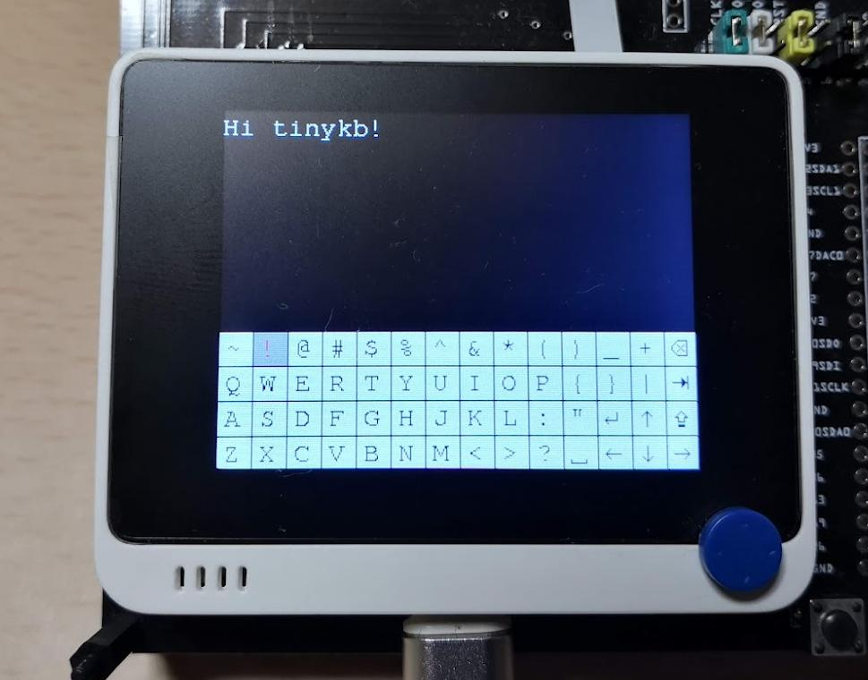

# tinykb

`tinykb` is a software keyboard for TinyGo.  
To use tinykb, it is necessary to implement the driver.Displayer interface.  

It is still an alpha version and the API is not yet fixed.  

## Usage

Currently, you can run `tinykb` on Wio Terminal or a PC.  
For Wio Terminal, you can try `tinykb` as follows.  

```
$ tinygo flash --target wioterminal --size short ./examples/keyboard/
```

On a PC, you can try the following.  
You will need to start up [tinydisplay](https://github.com/sago35/tinydisplay) beforehand.  

```
$ go run ./examples/keyboard/
```

See [./examples/keyboard](./examples/keyboard)  




## Author

sago35 - <sago35@gmail.com>

